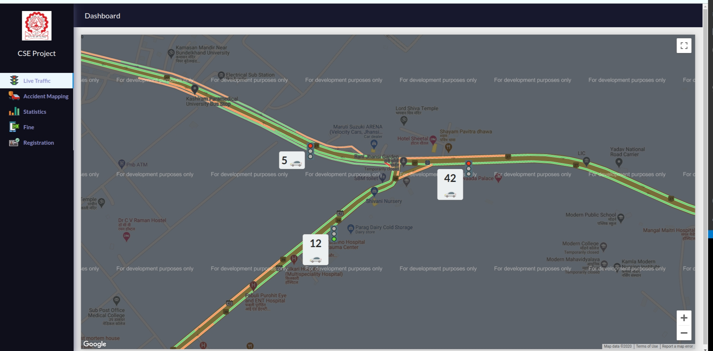
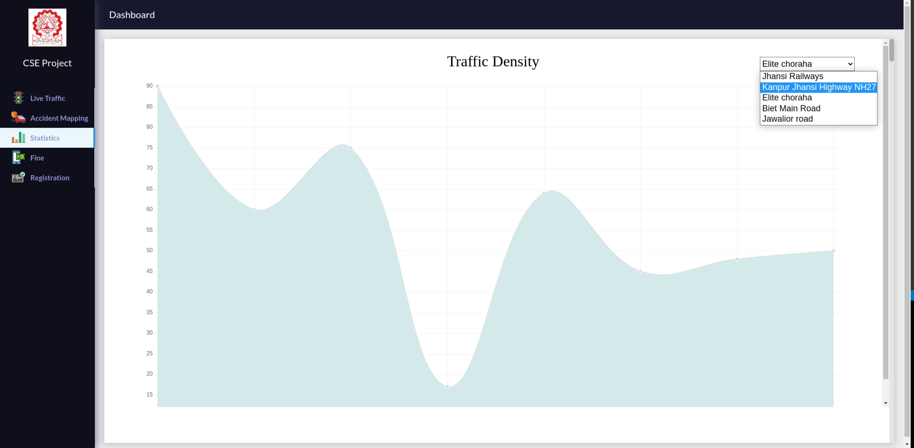
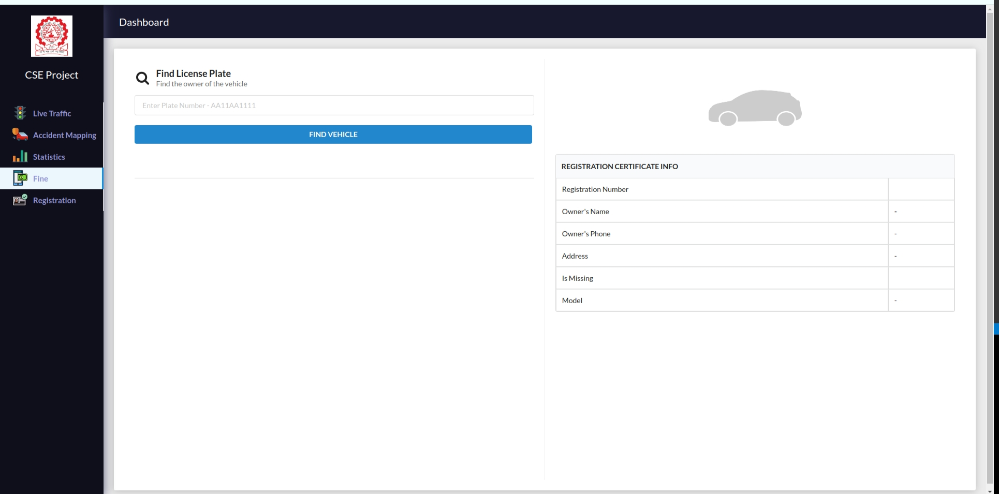
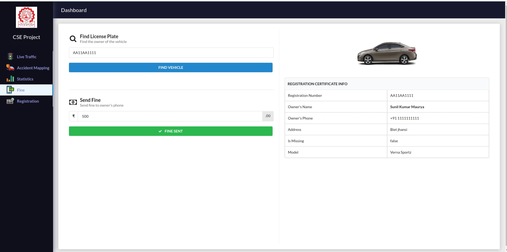
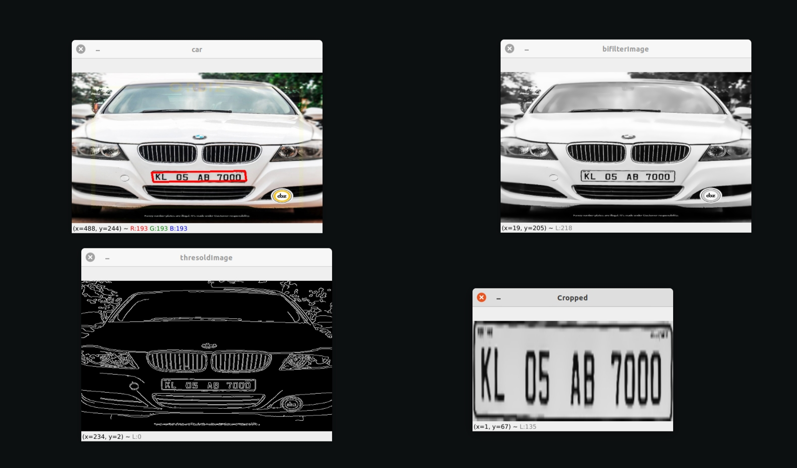
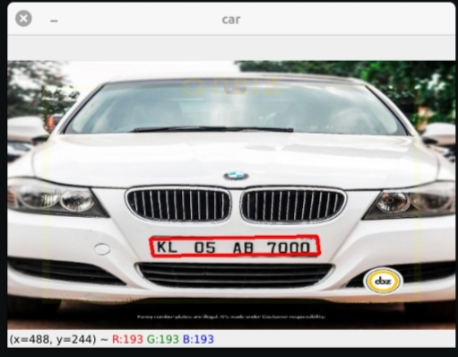
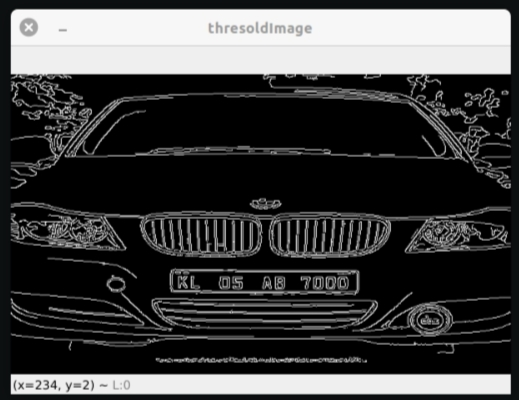
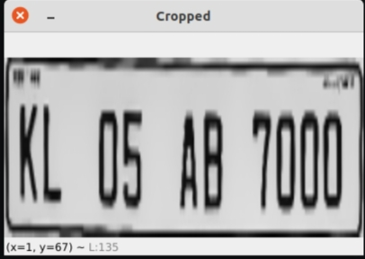
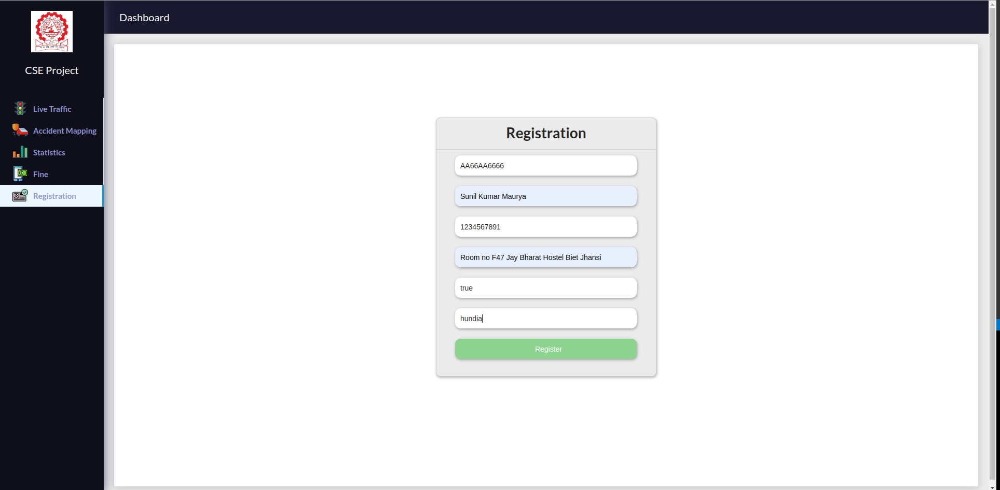
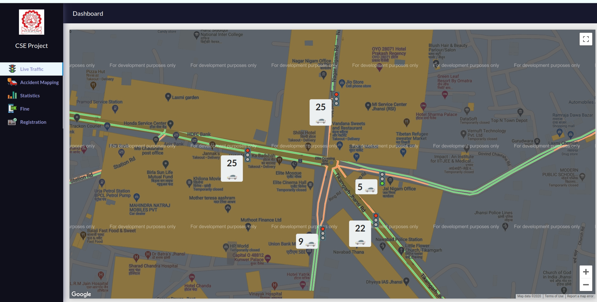

# Intelligence traffic monitoring system

### About
Due to a huge number of vehicles ,very busy road and parking which may not be possible manually as a
human being, tends to get fatigued due to monotonous nature of the job and they cannot keep track of the
vehicles when there are multiple vehicles are passing in a very short time. So modern cities need to
establish effective automatic systems for traffic management and scheduling.
The objective of this project is to design and develop an accurate and automatic number plate
recognition system, Automatic traffic light control using google Api live traffic density data, smart fine
system and also We can track the lost vehicle using vehicle number plate detection and find its
location by google Map API.
Intelligent Traffic Monitoring System (ITMS) is an image processing and machine learning technology to
identify vehicles by their license plates and we uses the microService of google API for live traffic density.

### Features
1. License plate number recognition.
2. Matching the plate number with Database.
3. Intelligence traffic light control using live traffic density data.
4. Show traffic density of particular area for some duration of month in form of graph.
5. Online Vehicle license registration.
6. Smart fine system.

###Applications
1. Automated track the location of stolen vehicle
2. Anti-Theft/ Vehicle detection.
3. Traffic light automation ,no requirement of Traffic police.
4. Smart fine /E Challan Systems.
5. Car Parking / Automatic Toll Deduction.
6. Law Enforcement
7. VIP/Ambulance path Clearance
8. Help the government to take

● Increase the efficiency of existing transport infrastructure
● Develop a license plate recognition system,
● Build a smart fine system and in future enhancement automated fine systems for vehicles.
● Live Traffic detection system and automated traffic light control system.
● Predict the traffic density using machine learning for specific areas by its previous data.
● Automated lost vehicle detection system and information to administration.
● Handle traffic congestion using automated light control system.

### Installation
* Clone the project.
* Run `yarn install` to install the dependencies.
* Run `yarn start` to view the project in action.

### OpenCV Demo to Count Vehicles
* In "countingCars" directory, run 'python count.py' .

### License plate detection
go to vehicle_number_by_its_pate folder and type python3 licenseplateDetection.py 1.jpg

#secreenshot

